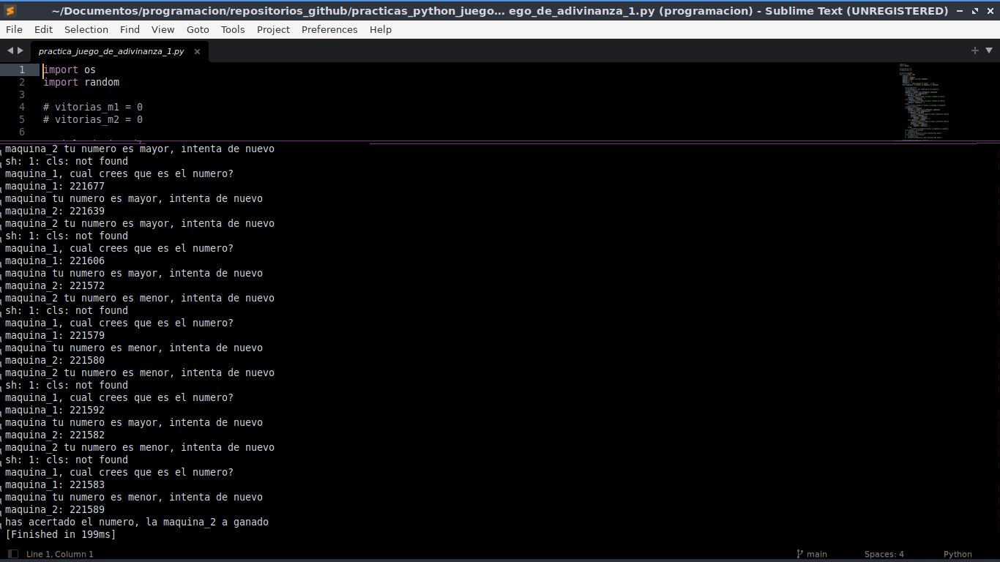
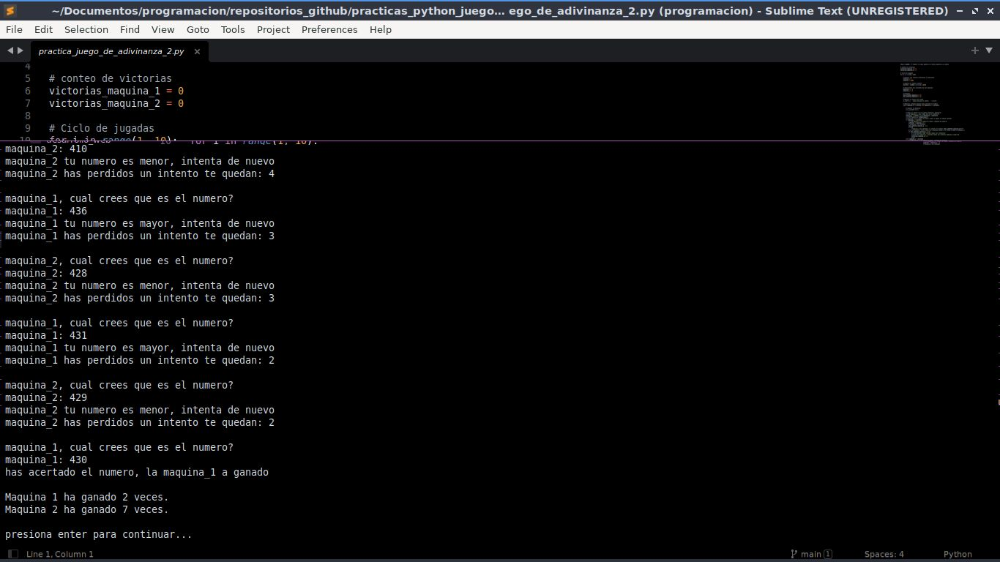
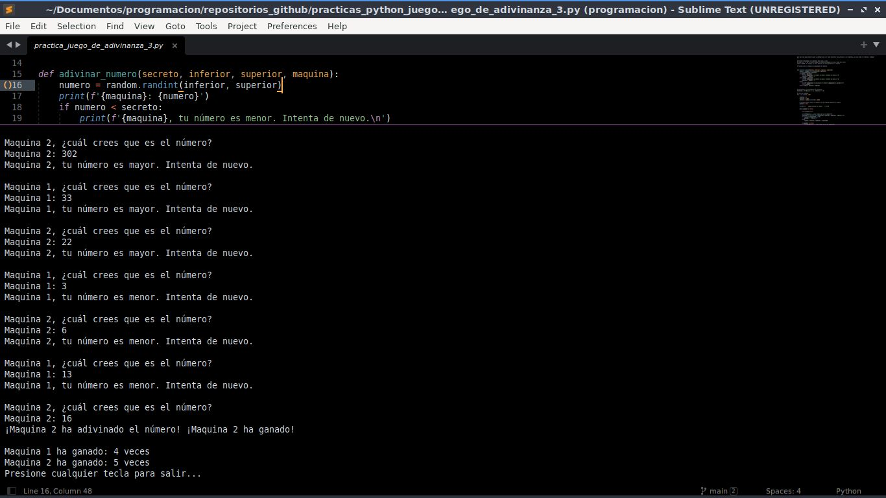

# practicas python juego adivinanza

este repositorio contiene una practica de juego de adivinanza, donde dos jugadores tienen que adivinar un numero secreto, el numero secreto se genera de forma aleatoria, y cada jugador genera su numero de forma aleatoria tambien

## capactura de funcionamiento de la practica juego de adivinanza 1

## capactura de funcionamiento de la practica juego de adivinanza 2

## capactura de funcionamiento de la practica juego de adivinanza 3
